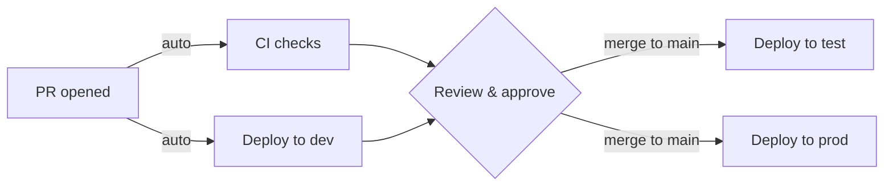

# Contributing

This project follows [trunk-based development](https://trunkbaseddevelopment.com/). All changes go through short-lived feature branches merged into `main`.

## Contribution Checklist

- [ ] Branch from `main`
- [ ] Follow [Conventional Commits](https://www.conventionalcommits.org/en/v1.0.0/) for PR title (e.g., `feat: add retry logic`)
- [ ] Ensure CI checks pass (build, tests, formatting)
- [ ] Get at least one approval before merging

## Deployment Flow

> **Note**: Merging to `main` triggers automatic deployment to both **test** and **prod**. Use the `deploy-prod-rollback.yml` workflow to roll back production if needed.
